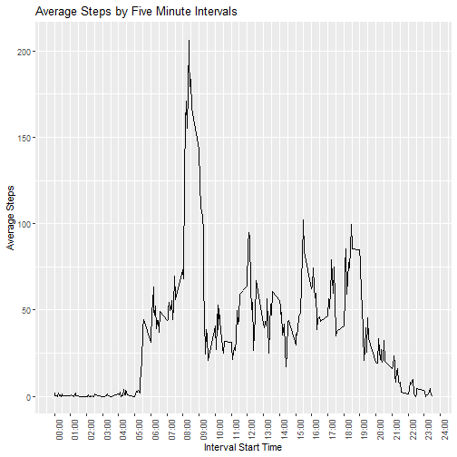
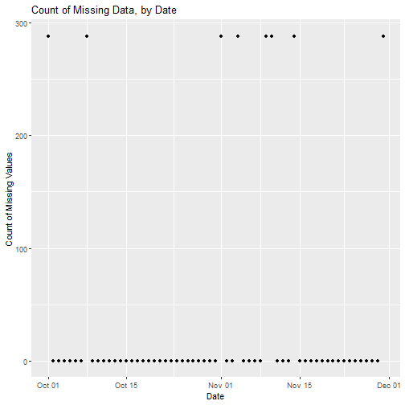
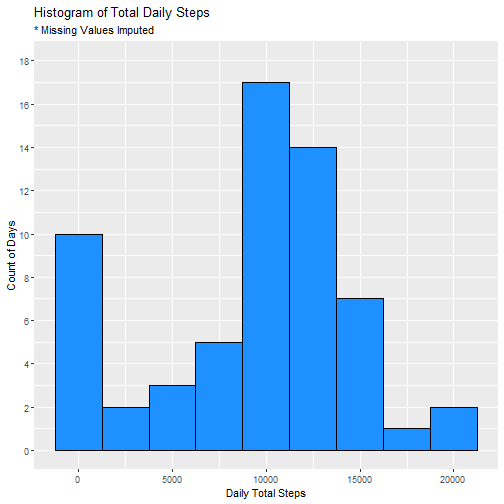
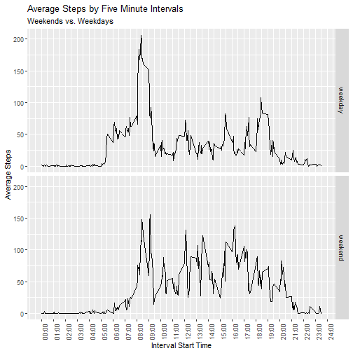

## Purpose

This document describes the step-by-step analysis of the data set provided for the Week 2 course project in the Johns Hopkins University Coursera course, Reproducible Research. It follows a sequence of specific instructions provided on the course website.

## Retrieve, Load, and Transform the Data.

The data for this exercise can be found at this link on [the course website](https://d396qusza40orc.cloudfront.net/repdata%2Fdata%2Factivity.zip). Below is the code to download the data to the current working directory, and unzip the file.  It also transforms the 'date' field from text to several other formats, to ease manipulation by date and time.


```r
url <- "https://d396qusza40orc.cloudfront.net/repdata%2Fdata%2Factivity.zip"
destfile = "rr_dataset.zip"
download.file(url = url, destfile = destfile, method = "curl")
filelist <- unzip(destfile)
df <- read.csv(filelist[1], stringsAsFactors = FALSE)
# Also transform the 'date' and 'interval' variables 
# df$date <- as.Date(df$date, "%Y-%m-%d")
df <- df %>%
  mutate(interv2 = str_pad(interval, 4, "left", "0")) %>%
  mutate(interv3 = paste0(substr(interv2, 1, 2), ":",substr(interv2, 3, 4))) %>%
  mutate(date_time_str = paste(date, interv3)) %>%
  mutate(date_time = ymd_hm(date_time_str)) %>%
  mutate(date = date(date_time))
```

## An Overview of the Data

The data set contains observations of one individual's five minute step count, for a continuous period of two months (61 days).

## The Questions
 
### Question 1: What is mean total number of steps taken per day?

To answer this question, we total the observations across all intervals for a given day, and then compute the mean across all days. We can see the code to do this and the answer below. Note there are missing observations, so we provide an argument in the code to ignore these.


```r
df_q1 <- df %>% 
  group_by(date) %>%
  summarize(daily_total = sum(steps, na.rm = TRUE))
q1_ans <- sprintf("%.1f",mean(df_q1$daily_total))
print(q1_ans)
```

```
## [1] "9354.2"
```

### Question 2: What is the average daily activity pattern? 

We will group the observations by the five minute intervals in which they were taken.  Using averages by interval across the data set, we will plot the average daily actity pattern.  Finally, we will identify which five minute interval had the highest average steps over the period of observation.


```r
df_q2 <- df %>% 
  group_by(interval) %>%
  summarize(interv_mean = mean(steps, na.rm = TRUE)) %>%
  inner_join(unique(df[,3:5]), by = "interval")

hours_str_vec <- subset(df_q2$interv3, grepl("*:00$", df_q2$interv3))
hours_str_vec <- c(hours_str_vec, "24:00")

g <- ggplot(df_q2, aes(x = interval, y = interv_mean)) +
      geom_line() +
  scale_x_continuous(breaks = seq(0,2400, 100), labels = 
                       hours_str_vec) + 
  theme(axis.text.x = element_text(angle = 90)) + 
  labs(title = "Average Steps by Five Minute Intervals", y = "Average Steps", x = "Interval Start Time")

print(g)
```



```r
myrow <- df_q2 %>% filter(interv_mean == max(interv_mean))
ans_2b <- round(myrow$interv_mean)
```

We can see from the chart above the highest peak takes place in the morning.  Specifically, the five minute interval with the highest average starts at 08:35, with an average number of 206 steps.

### Question 3: What about missing data?

First we will count how many values are missing from the data set. Next we will report the percentage of missing observations, and then plot their distribution.


```r
ans_3a <- label_percent()(sum(is.na(df$steps))/length(df$steps))

print(paste(ans_3a, "of values are missing."))
```

```
## [1] "13% of values are missing."
```

```r
df_q3a <- df %>%
  group_by(date) %>%
  summarize(na_count = sum(is.na(steps)))

ggplot(df_q3a, aes(x=date, y=na_count)) +
  geom_point() + 
  labs(title = "Count of Missing Data, by Date",
       x = "Date", y = "Count of Missing Values")
```



From the above chart we see that, of the 288 five minute intervals in a 24 hour day, the dates of observations were either missing all or none of the values.  Based on this, and the high variability during the course of the day, I choose to use the median value (excluding missing values, of course) for each five minute interval to impute the missing data.  The code below performs this task.


```r
# compute interval median value for 'steps'
df_q3 <- df %>% 
  group_by(interval) %>%
  summarize(interv_med = median(steps, na.rm=TRUE))

# add medians to the data set, and use them if 'steps' is 'NA'
df_q3b <- left_join(df, df_q3, by = "interval") %>%
  mutate(new_steps = ifelse(is.na(steps), interv_med, steps))
```


Next we create a new data set equal to the first, but with the imputed data values.  We will use this data frame to then compute the daily mean and median activity levels.


```r
# per the instructions, create a new data set that is equivalent to # the original, but with the imputed values.
new_df <- df_q3b %>%
  select(steps = new_steps, date, interval)

df_q3c <- new_df %>%
  group_by(date) %>% 
  summarize(daily_steps = sum(steps, na.rm = TRUE))

ggplot(df_q3c, aes(x = daily_steps)) +
  geom_histogram(binwidth = 2500, fill = "dodger blue", color = "black") + 
  scale_y_continuous(limits = c(0, 18), breaks = seq(0, 18, 2)) +
  labs(title = "Histogram of Total Daily Steps", 
       subtitle = "* Missing Values Imputed",
       x = "Daily Total Steps",
       y = "Count of Days")
```



Note that while it seems there are many days (10, in fact) with nearly zero activity, we did have eight days imputed in their entirety, and we imputed zeroes into many intervals.


```r
ans_3b <- sprintf("%.1f", mean(df_q3c$daily_steps))
ans_3c <- sprintf("%.1f", median(df_q3c$daily_steps))
```

Finally, we report the daily mean and median total steps, after imputing missing values.  The mean and median are 9503.9 and 10395.0, respectively. 

Note both the mean and median computed based on imputed values are above the daily mean we originally computed, 9354.2.

================== 
 
### Question 4: Are there differences in activity patterns between weekdays and weekends?

We answer the question above by categorizing our data (using the imputed values) into weekends and weekdays, and building plots side-by-side (technically, over-and-under) for a quick visual comparison.


```r
df_q4 <- new_df %>%
  mutate(day_of_week = weekdays(date)) %>%
  mutate(type_of_day = ifelse(day_of_week %in% c("Saturday", 
                                                 "Sunday"),
                              "weekend", "weekday"))

df_q4a <- df_q4 %>% 
  group_by(type_of_day, interval) %>%
  mutate(interv_mean = mean(steps))

ggplot(df_q4a, aes(x=interval, y=interv_mean)) +
  geom_line() +
  facet_grid(type_of_day ~ .) +
  scale_x_continuous(breaks = seq(0,2400, 100), labels = 
                       hours_str_vec) + 
  theme(axis.text.x = element_text(angle = 90)) + 
  labs(title = "Average Steps by Five Minute Intervals", 
       subtitle = "Weekends vs. Weekdays",
       y = "Average Steps", x = "Interval Start Time")
```



From the plot above, we can see several differences: First, activity on weekdays starts earlier.  Second, activity on weekdays ends earlier as well, starting to decrease around 19:00 (compared to 20:00 on weekends).  Finally, there is more activity in the middle of the day, from roughly 09:00 to 17:00. 

##  Closing comments

If you've made it this far, thank you for your thorough review!  Any errors or suggestions you can share are appreciated.  I'm always interested in being more efficient, particularly with ggplot2 functions and arguments.
